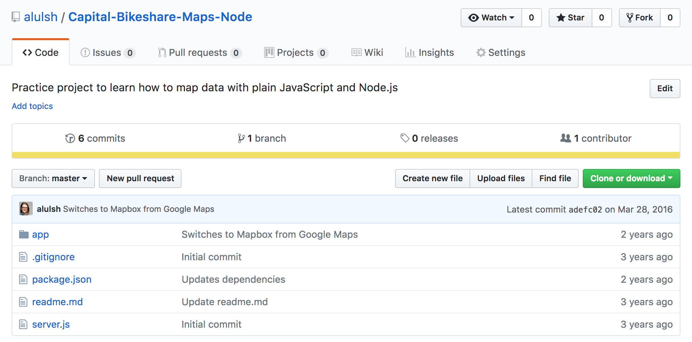
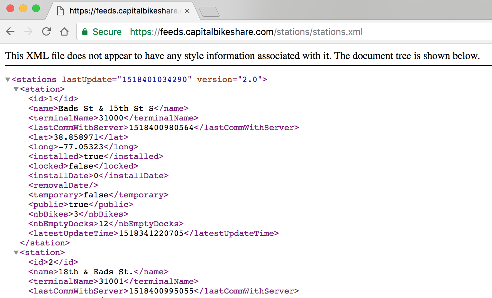
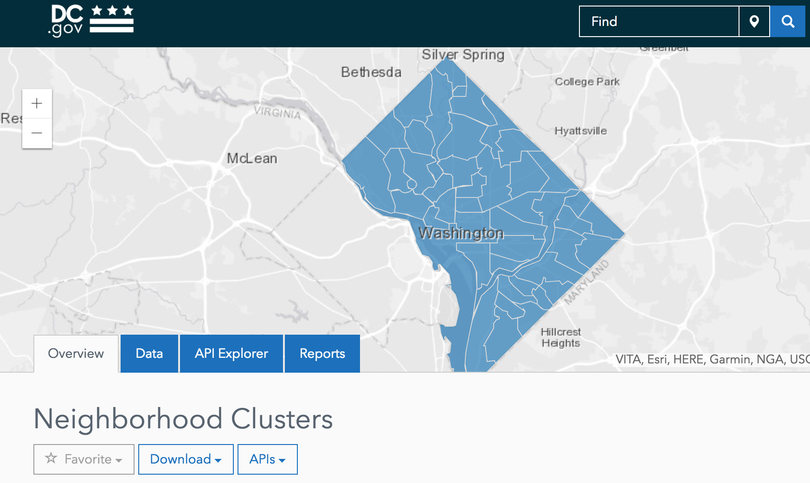
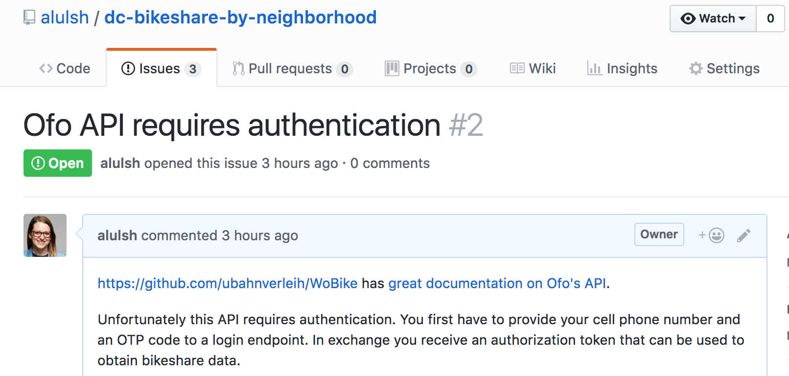
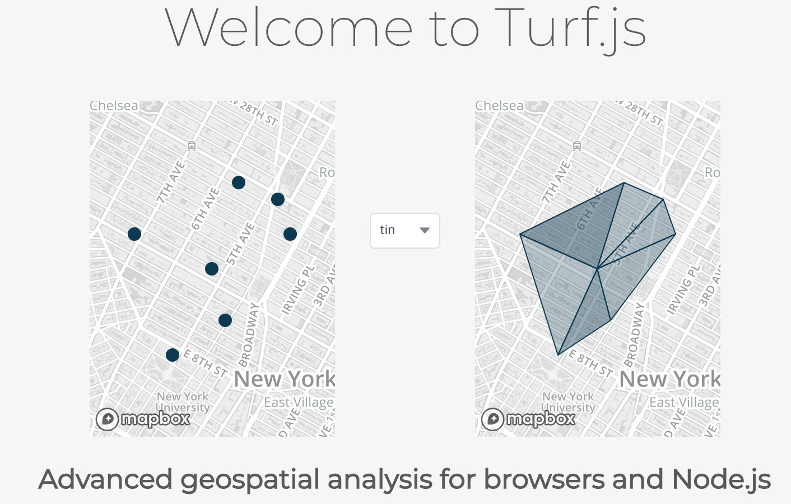
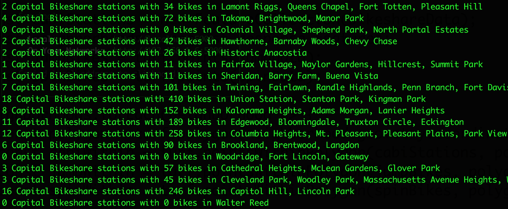
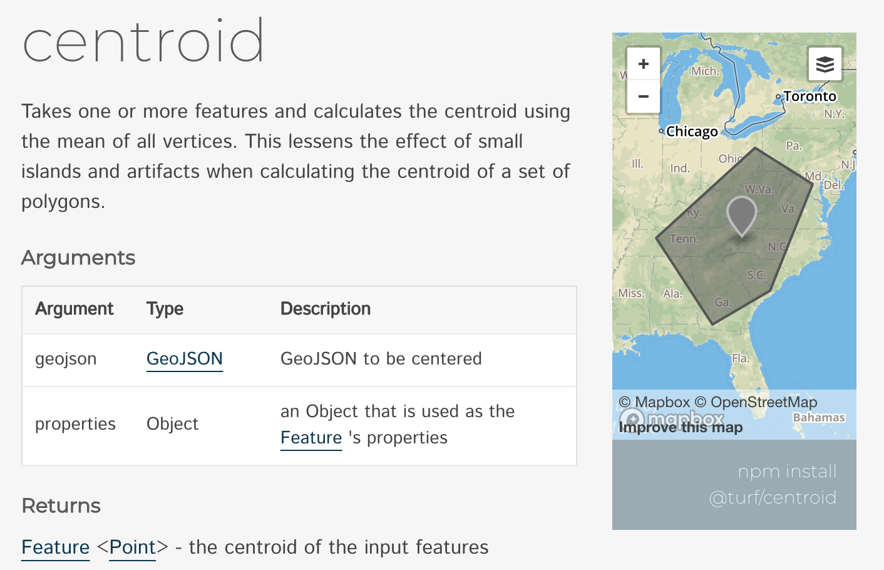
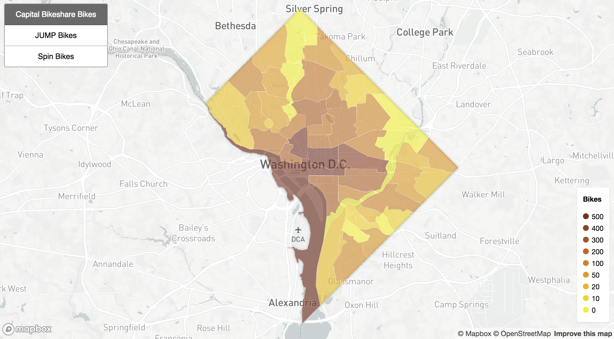

# DC Bikeshare Bikes By Neighborhood

## Transportation Techies

### February 13th 2018

---

# Alexandra Ulsh

Information Security Engineer

Mapbox

[@AlexUlsh](https://twitter.com)

---

# 2015 - How many Capital Bikeshare bikes are there per DC quadrant?

---



---


---



---

# 2018 - How many bikeshare bikes are there per DC neighborhood?

---

# Challenge

## Only use GitHub Pages and client side JavaScript!

---



---


---

# Public APIs

- [x] Capital Bikeshare
- [x] JUMP Bikes
- [~] Spin
- [~] LimeBike
- [ ] Ofo
- [ ] Mobike

---

# GBFS

## General Bikeshare Feed Specification

---


---

LimeBike

CORS errors :(


---

# Node script for LimeBike

Demo time

---



---


---

# How do I calculate the number of bikes per neighborhood?

---



---

# `turf.pointsWithinPolygon`

```js
neighborhoods.forEach(neighborhood => {
  const polygon = turf.polygon(neighborhood.geometry.coordinates);
  const cabiWithin = turf.pointsWithinPolygon(cabiStations, polygon);
  const jumpWithin = turf.pointsWithinPolygon(jumpBikes, polygon);
  const spinWithin = turf.pointsWithinPolygon(spinBikes, polygon);
}
```
---

# Cabi bikes, not stations

```js
let totalBikes = 0;
cabiWithin.features.forEach(station =>{
  totalBikes += station.properties.capacity;
});
```

---



---



---

# Choropleth map with data-driven styling



---

```js
map.addLayer({
  id: `cabibikes-${neighborhood.properties.OBJECTID}`,
  type: 'fill',
  source: {
    type: 'geojson',
    data: neighborhood
  },
  layout: {
    visibility: 'none'
  },
  paint: {
    'fill-color': {
      property: 'cabiBikes',
      stops: [
        [0, '#F2F12D'],
        [10, '#EED322'],
        [20, '#E6B71E'],
        [50, '#DA9C20'],
        [100, '#CA8323'],
        [200, '#B86B25'],
        [300, '#A25626'],
        [400, '#8B4225'],
        [500, '#723122']
      ]
    },
    'fill-opacity': 0.6,
    'fill-outline-color': '#FFF'
  }
});
```

---

# How do I load data from 3 APIS?

---

# Promises

---

```js
function jumpData(){
  let bikeArray = [];

  return new Promise((resolve) => {
    let request = new XMLHttpRequest();
    request.open('GET', 'https://dc.jumpmobility.com/opendata/free_bike_status.json');
    request.responseType = 'json';
    request.send();
    request.onload = () => {
      const bikes = request.response.data.bikes;
      bikes.forEach(bike => {
        let lonLat = [];
        lonLat.push(bike.lon);
        lonLat.push(bike.lat);
        bikeArray.push(lonLat);
      });
      resolve(bikeArray);
    };
  });
}
```

---

```js
map.on('load', () => {

  let bikeshare = cabiData()
    .then(res => res)
    .catch(err => console.error(err));

  let jumpBike = jumpData()
    .then(res => res)
    .catch(err => console.error(err));

  let spinBike = spinData()
    .then(res => res)
    .catch(err => console.error(err));

  Promise.all([bikeshare, jumpBike, spinBike]).then(res => {
    loadDcNeighborhoods(res[0],res[1],res[2]);
  });

});
```

---

Code:
https://github.com/alulsh/dc-bikeshare-by-neighborhood

<br/>

Site:
https://www.alexandraulsh.com/dc-bikeshare-by-neighborhood/

---

# Questions?

@AlexUlsh

alexandra.ulsh@gmail.com
